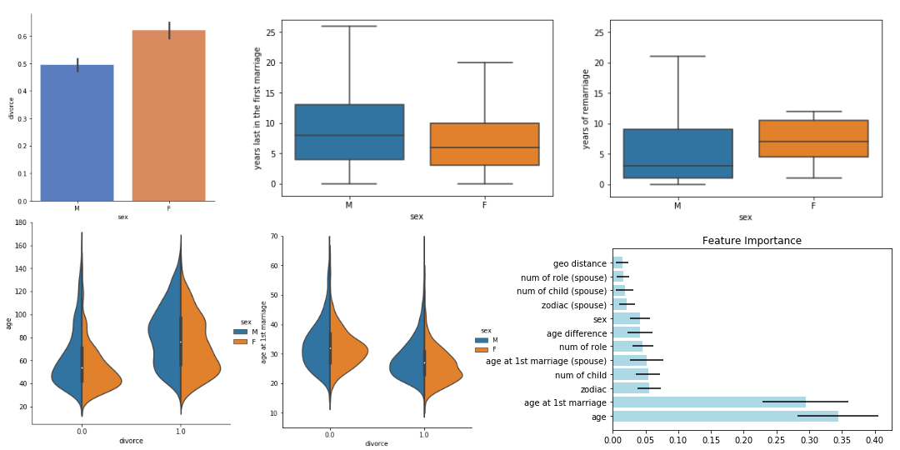
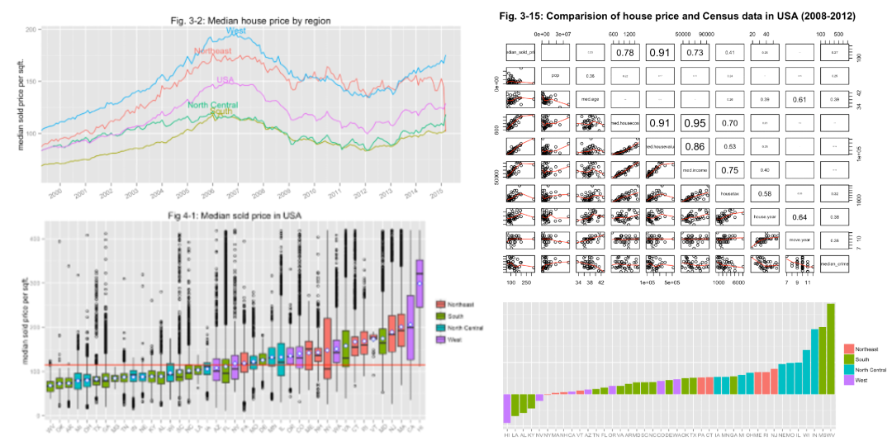
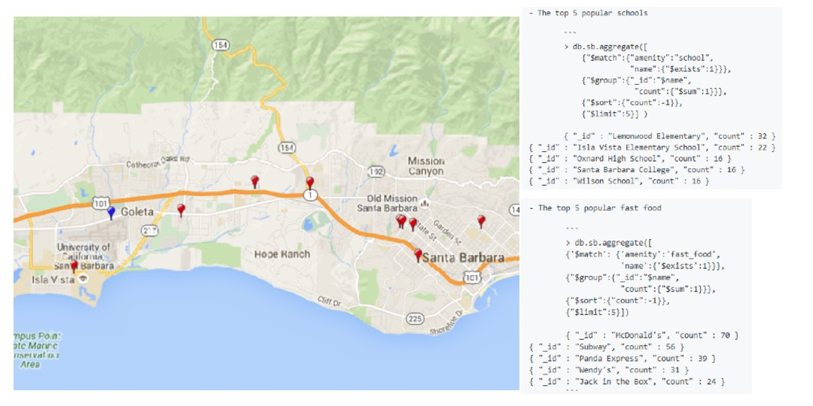
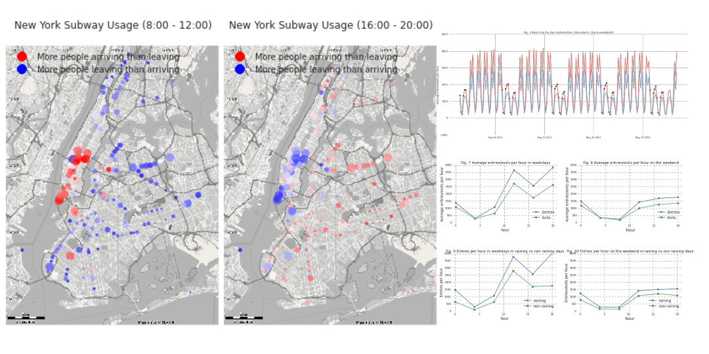

## Data Science Portfolio 

---

### Machine Learning

[Is a Higher Divorce Rate Among Celebrities?](https://github.com/cyuancheng/BlogPost_Celebrity_Divorce)
 [(Medium posting)](https://medium.com/@cyuancheng/is-a-high-divorce-rate-among-celebrities-b87a9b9bdf28)
 Wrangled Wikipedia data of Hollyword's celebrities and used Logistic Regression and Random Forest to predict celebrities' divorce with 70% accuracy. 

---
[Disaster Response Pipeline](/Project_2)

---
[Predict Customer Churn](/Project_3)

---
[Finding Donors for CharityML](/Project_3)

---
[Identify Customer Segments](/Project_3)

---
[Recommendation system with IBM](/Project_3)

### Deep Learning
---
[Predict Stock Price with Buy or Sell Signal](/Project_4)

---
[Lawn Weed Detector using Computer Vision](/Project_5)

---
### Natural Language Processing

---
[Twitter review](/Project_7)

---
[Yelp review](/Project_7)

## Data Analysis / Visulization

[Analyzing Zillow Housing Data with R](http://rpubs.com/cyuancheng/ZillowHousing)
 Conducted exploratory data analysis using R to explore underlying relationships of the residential real estate Zellow data and Census data in USA between 1996 and 2014. 

---
[Wrangling Openstreetmaps Data with MongoDB](https://github.com/cyuancheng/Data-Wrangle-Openstreetmaps-Data/)
 Used MongoDB to wrangle, clean and explore the OpenStreetMap (OSM) data in Santa Barbara County, CA. 

---
[Analyzing NYC Subway Dataset with Python](https://nbviewer.jupyter.org/github/cyuancheng/Intro-Data-Science/blob/master/AnalyzingNYCSubwayDataset.ipynb)
 Used statistical analysis and exploratory data analysis to discover interesting patterns about the New York City Subway and discovered more people entering NYC Subway in rainy days. 

