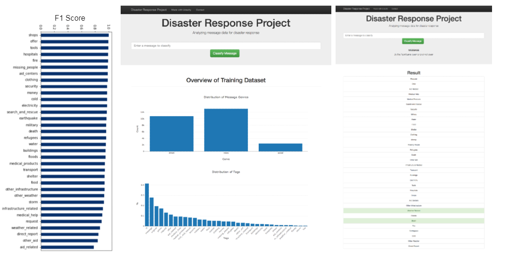
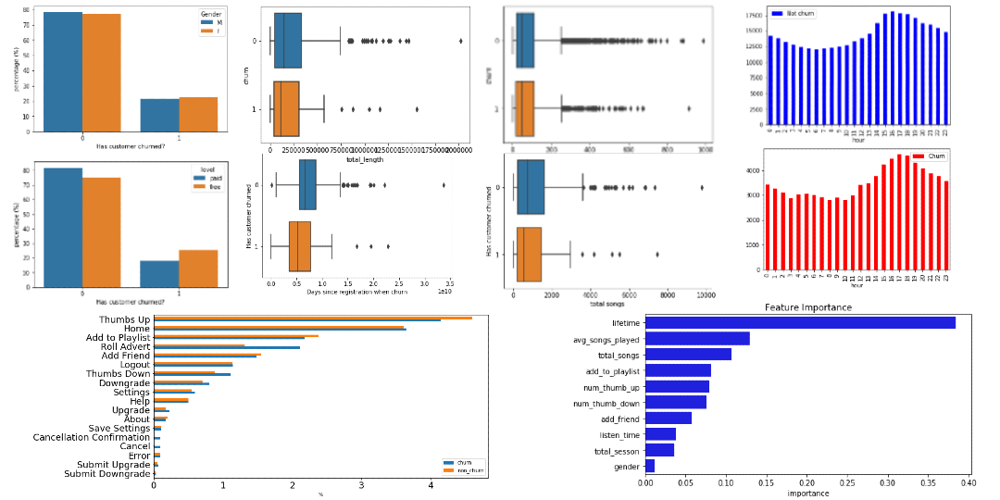
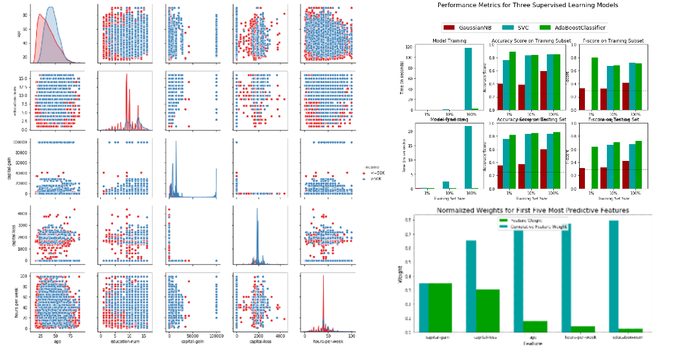
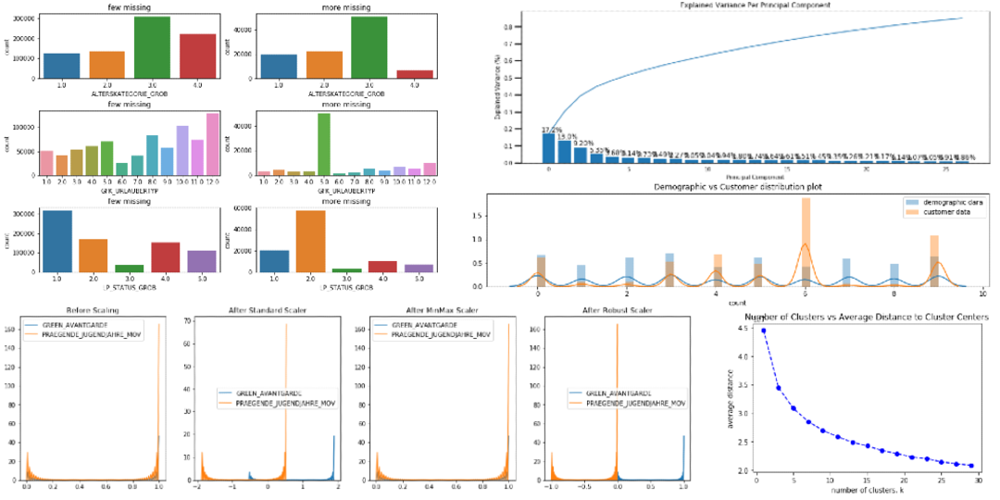
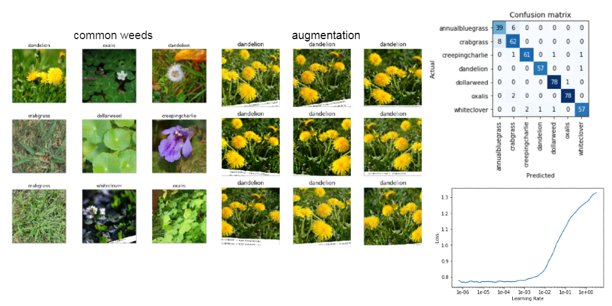

## Portfolio 

---

### Machine Learning

[Is a Higher Divorce Rate Among Celebrities?](https://github.com/cyuancheng/BlogPost_Celebrity_Divorce)
 [\[Medium posting\]](https://medium.com/@cyuancheng/is-a-high-divorce-rate-among-celebrities-b87a9b9bdf28)
 Wrangled Wikipedia data of Hollyword's celebrities and used Logistic Regression and Random Forest to predict celebrities' divorce with 70% accuracy.

__tool: xxx__

---
[AI Pipeline for Disaster Response](https://github.com/cyuancheng/Disaster-Response-Pipeline)
 Created ETL and machine learning pipeline from real natural disaster message data. Developed a web app where a relief agent can input a new message to get classification result in a real time.

---
[Predict Customer Churn with PySpark](https://github.com/cyuancheng/Sparkify)
 [(Medium posting)](https://medium.com/@cyuancheng/use-machine-learning-to-predict-customer-churn-9281cc249c7a)
 Prepossessed, cleaned, and transformed 250 Mb of customer data from music streaming platform using PySpark. Developed a predictive model from  feature engineering using Random Forest and Gradient Boosting Tree in Spark MLlib. Feature importance by the model suggested the customer's lifetime with the service is the strongest indicator for churn. 

---
[Finding Donors for CharityML (Supervised Learning)](https://github.com/cyuancheng/Finding-Donors-for-CharityML/blob/master/finding_donors.ipynb)
 Built a machine learning model that accurately predicts whether an individual makes more than $50,000, to identify likely donors for a fictional non-profit organisation. 

---
[Identify Customer Segments (Unsupervised Learning)](https://github.com/cyuancheng/Identify_Customer_Segments/blob/master/Identify_Customer_Segments.ipynb)
 Used unsupervised learning (PCA and Kmeans) to identify segments of the population that form the core customer base for a mail-order sales company in Germany. By comparing general population and customers population, segments were identified that could be target for future marketing campaigns or to be considered outside of company interests. 

---

### Deep Learning
---
[Predict Stock Price with Buy or Sell Signal](/Project_4)

---
[Lawn Weed Detector using Computer Vision](https://github.com/cyuancheng/Lawn_Weed)
 Collected and labeled imaging data of common weeds from Google Image, and trained the data using Convolutional Neural Network (CNN) with 95% accuracy. 

---
### Natural Language Processing

---
[Twitter review](/Project_7)

---

[Yelp review](/Project_7)

---

### Recommendation System
[Buid a Recommendation System on IBM Cloud](https://github.com/cyuancheng/recommendation_with_IBM)
 Analyzed the interactions that users have with articles on the IBM Watson Studio platform, and made recommendations of articles they will like 

---

### Data Analysis / Visulization

[Analyzing Zillow Housing Data with R](http://rpubs.com/cyuancheng/ZillowHousing)
 Conducted exploratory data analysis using R to explore underlying relationships of the residential real estate Zellow data and Census data in USA between 1996 and 2014. 

---
[Wrangling Openstreetmaps Data with MongoDB](https://github.com/cyuancheng/Data-Wrangle-Openstreetmaps-Data/)
 Used MongoDB to wrangle, clean and explore the OpenStreetMap (OSM) data in Santa Barbara County, CA. 

---
[Analyzing NYC Subway Dataset with Python](https://nbviewer.jupyter.org/github/cyuancheng/Intro-Data-Science/blob/master/AnalyzingNYCSubwayDataset.ipynb)
 Used statistical analysis and exploratory data analysis to discover interesting patterns about the New York City Subway and discovered more people entering NYC Subway in rainy days. 

