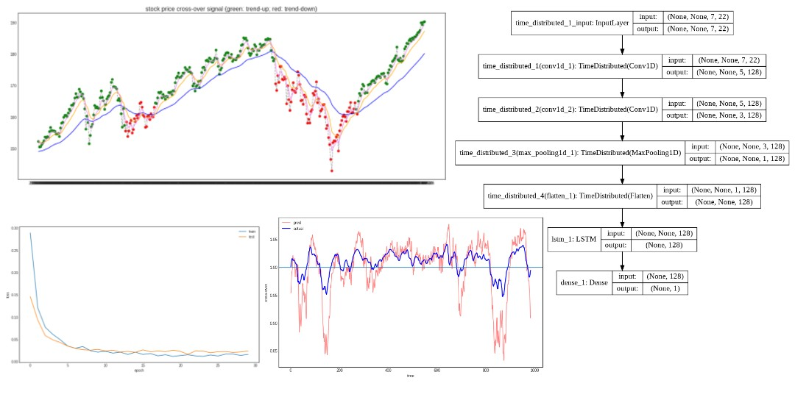
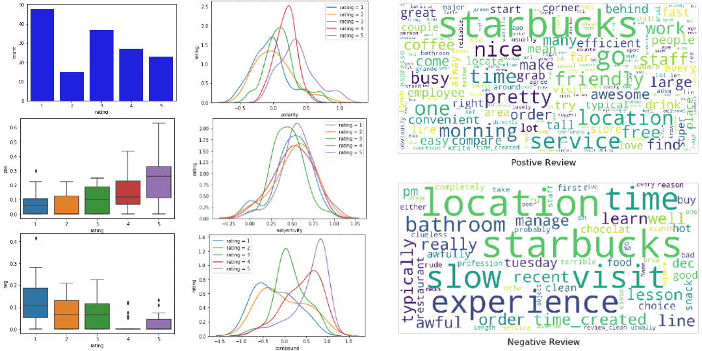
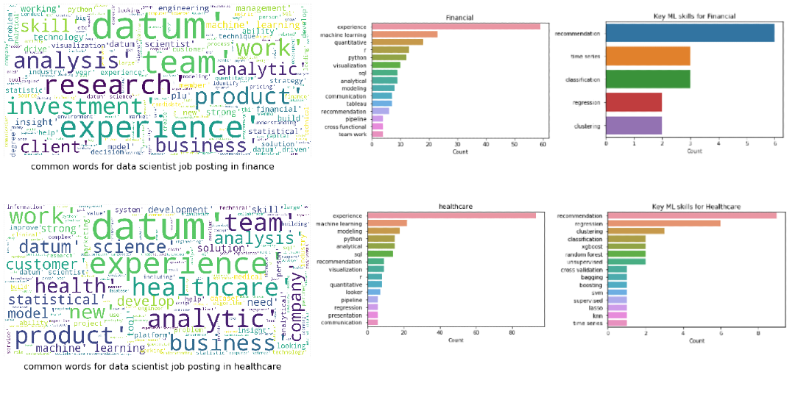

# Portfolio 

---

## Machine Learning

[Is a Higher Divorce Rate Among Celebrities?](https://github.com/cyuancheng/BlogPost_Celebrity_Divorce)   

Wrangled Wikipedia data of Hollyword's celebrities and used Logistic Regression and Random Forest to predict celebrities' divorce with 70% accuracy.

<!-- 
  Python package: requests, BeautifulSoup, pandas, numpy, nltk, re

-->
---
[AI Pipeline for Disaster Response](https://github.com/cyuancheng/Disaster-Response-Pipeline)

Created ETL and ML pipeline from real natural disaster message data. Developed a web app where a relief agent can input a new message to get classification result in a real time.

---
[Predict Customer Churn with PySpark](https://github.com/cyuancheng/Sparkify)   

Used PySpark to preprocess and transform 250 Mb of customer data from music streaming platform. Feature engineering using Random Forest and Gradient Boosting Tree suggested the customer's lifetime with the service is the strongest indicator for churn.

---
[Finding Donors for CharityML (Supervised Learning)](https://github.com/cyuancheng/Finding-Donors-for-CharityML/blob/master/finding_donors.ipynb)

Built a machine learning model to predicts whether an individual makes more than $50,000 and identify likely donors for a fictional non-profit organisation. 

---
[Identify Customer Segments (Unsupervised Learning)](https://github.com/cyuancheng/Identify_Customer_Segments/blob/master/Identify_Customer_Segments.ipynb)

Used unsupervised learning (PCA and Kmeans) to identify segments of the population that form the core customer base for a mail-order sales company in Germany. By comparing general population and customers population, the identified segments could be targets for future marketing campaigns or to be considered outside of company interests.

---
### Deep Learning

[Predict Stock Price with Buy or Sell Signal](https://github.com/cyuancheng/Stock_Prediction/blob/master/ETF_QQQ_CrossSignal.ipynb)

Built a LSTM model on stock data and technical indicators to predict market movement with 70% accuracy. This is a capstone project working together with AI enthusiasts of [the Princeton School of AI](https://www.meetup.com/Princeton-School-of-AI/) in summer 2019. My role in the team is to develop and refine the time-series model using Recurrent Neural Network (RNN). 

---
[Lawn Weed Detector using Computer Vision](https://github.com/cyuancheng/Lawn_Weed)

Collected and labeled imaging data of common weeds from Google Image, and trained the data using Convolutional Neural Network (CNN) with 95% accuracy.

---
### Natural Language Processing

[Sentiment Analysis on Yelp Review](https://github.com/cyuancheng/NLP_Yelp_review/blob/master/NLP_Yelp_Starbucks.ipynb)

Performed sentiment analysis on the Yelp review for Starbucks in New York City.

---

[Key Analysis on Data Scientist Job Posting](https://github.com/cyuancheng/Job_Description_Screen/blob/master/JobDescriptionScreen.ipynb)

A small project to extract key words from job description of data scentist job posting in different categories.

---

### Recommendation System

[Buid a Recommendation System on IBM Cloud](https://github.com/cyuancheng/recommendation_with_IBM)

Analyzed the interactions that users have with articles on the IBM Watson Studio platform, and made recommendations of articles they will like

---

### Data Analysis / Visulization

[Analyzing Zillow Housing Data with R](http://rpubs.com/cyuancheng/ZillowHousing)

Conducted exploratory data analysis using R to explore underlying relationships of the residential real estate Zellow data and Census data in USA between 1996 and 2014.

---
[Wrangling Openstreetmaps Data with MongoDB](https://github.com/cyuancheng/Data-Wrangle-Openstreetmaps-Data/)

Used MongoDB to wrangle, clean and explore the OpenStreetMap (OSM) data in Santa Barbara County, CA.

---
[Analyzing NYC Subway Dataset with Python](https://nbviewer.jupyter.org/github/cyuancheng/Intro-Data-Science/blob/master/AnalyzingNYCSubwayDataset.ipynb)

Used statistical analysis and exploratory data analysis to discover interesting patterns about the New York City Subway and discovered more people entering NYC Subway in rainy days.

